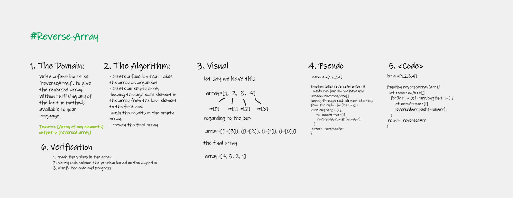

# Reverse Array Function 
write a function that takes an array as input and return 
a reverse array as output.

## Whiteboard Process

## Approach & Efficiency
use for loop and push method to reverse an array .
