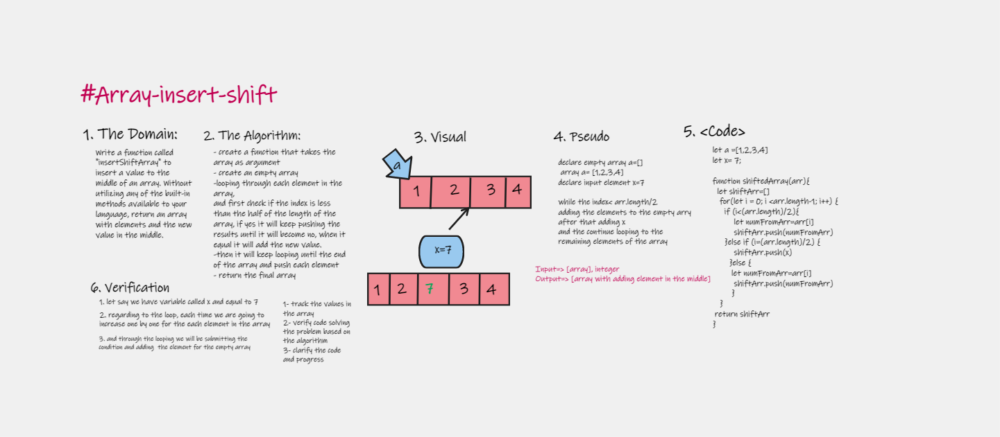

# Insert Shift Array Function 
Write a function called insertShiftArray which takes in an array and a value to be added. Without utilizing any of the built-in methods available to your language, return an array with the new value added at the middle index.

## Whiteboard Process

## Approach & Efficiency
use for loop, if and push method to insert an element to the middle of an array .
