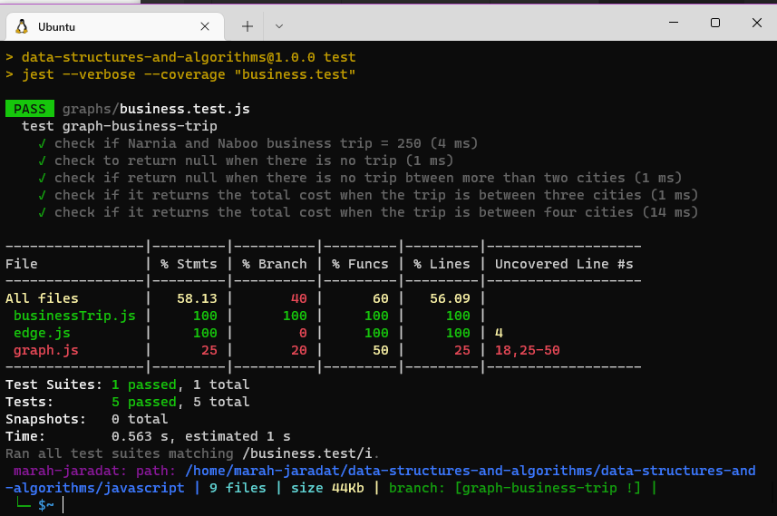

# graph-business-trip

Given a business trip itinerary, and an Alaska Airlines route map, is the trip possible with direct flights? If so, how much will the total trip cost be?

## Features

- Write a function called business trip
- Arguments: graph, array of city names
- Return: the cost of the trip (if it’s possible) or null (if not)
- write tests for every possible senario
    ✓check if Narnia and Naboo business trip = 250 
    ✓ check to return null when there is no trip 
    ✓ check if return null when there is no trip btween more than two cities 
    ✓ check if it returns the total cost when the trip is between three cities 
    ✓ check if it returns the total cost when the trip is between four cities

### Efficiency

| method|Time complexity |Space complexity | 
| :---: | :---: | :---: |
|graph-business-trip|O(n^2): using 2 for loops | O(n)|

