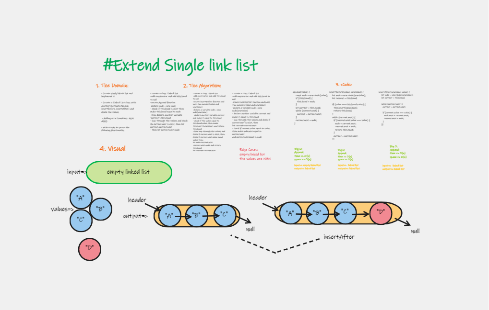

# Implementation:  Extending an Implementation 

Extend a Linked List to allow various insertion method

## Feature Tasks

Write the following methods for the Linked List class:

1. append
   arguments: new value
   adds a new node with the given value to the end of the list
2. insert before
   arguments: value, new value
   adds a new node with the given new value immediately before the first node that has the value specified
3. insert after
   arguments: value, new value
   adds a new node with the given new value immediately after the first node that has the value specified
3. Adding error handelers: 404 &500
4. Write tests to prove the following functionality

## Approach & Efficiency

| method|Time complexity |Space complexity | 
| :---: | :---: | :---: |
| append|O(n): because used while loop and adding by if | O(n)|
| insert before|O(n):using while and adding |O(n) |
| insert after|O(n):using while loop and adding |O(n) |

## Whiteboard Process

