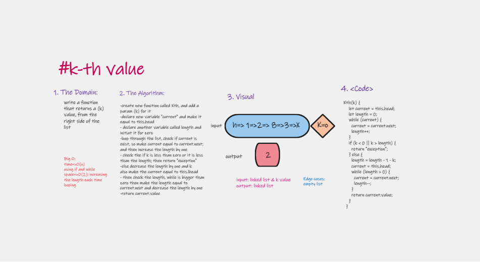

# Implementation:  Extending an Implementation "k-th value"

k-th value from the end of a linked list.

## Feature Tasks

Write the following methods for the Linked List class:

1. kth from end
argument: a number, k, as a parameter.
Return the node’s value that is k places from the tail of the linked list.

2. Adding error handelers: 404 &500
3. Write tests to prove the following functionality

## Approach & Efficiency

| method|Time complexity |Space complexity | 
| :---: | :---: | :---: |
| k-th value |O(n): because used while loop and adding by if | O(2): increasing the length of list in each loop |

## Whiteboard Process

