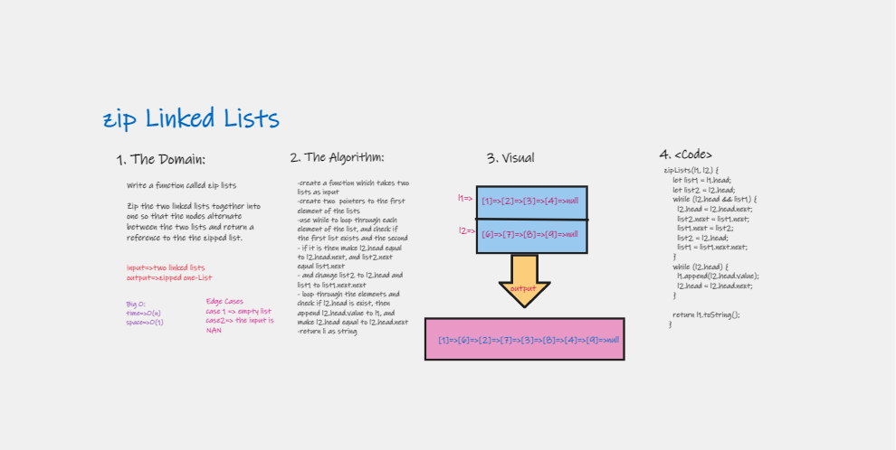

# Implementation: stack-and-queue

Using a Linked List as the underlying data storage mechanism, implement both a Stack and a Queue

## Features

1. Create a Node class that has properties for the value stored in the Node, and a pointer to the next node.
2. Create a Stack class that has a top property. 
   - push: 
   - pop:
   - peek:
   - is empty:
  
3. Create a Queue class that has a front property. 
   - enqueue:
   - dequeue:
   - peek:
   - is empty:

   include: loop through the list to check the values
4. Write tests to prove the following functionality

## Approach & Efficiency

| method|Time complexity |Space complexity | 
| :---: | :---: | :---: |
| zip  two lists|O(n): used while loop| O(n): adding new elements|

## Whiteboard Process

