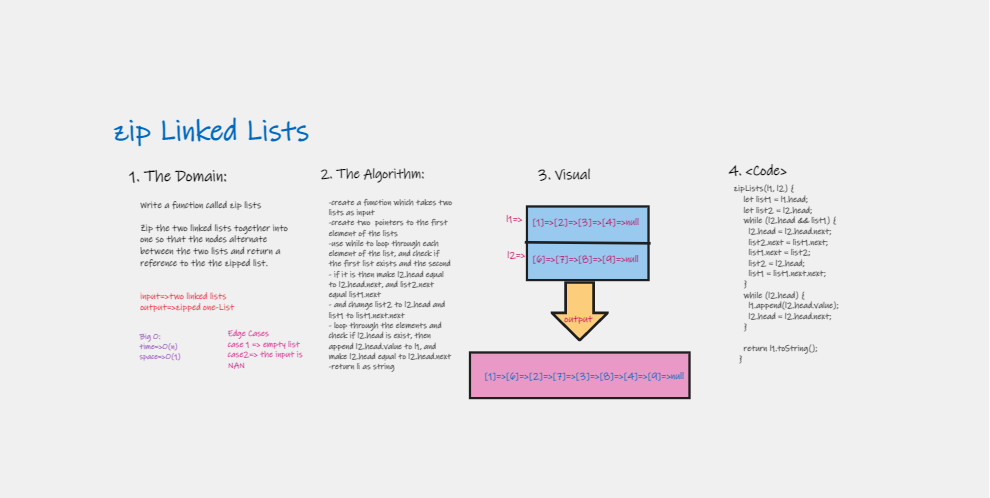

# Implementation: linked-list-zip

Zip two linked lists.

## Features

1. Write a function called zip lists
    Arguments: 2 linked lists
    Return: New Linked List, contains the two lists
    
2. Write tests to prove the following functionality

## Approach & Efficiency

| method|Time complexity |Space complexity | 
| :---: | :---: | :---: |
| zip  two lists|O(n): used while loop| O(n): adding new elements|

## Whiteboard Process

