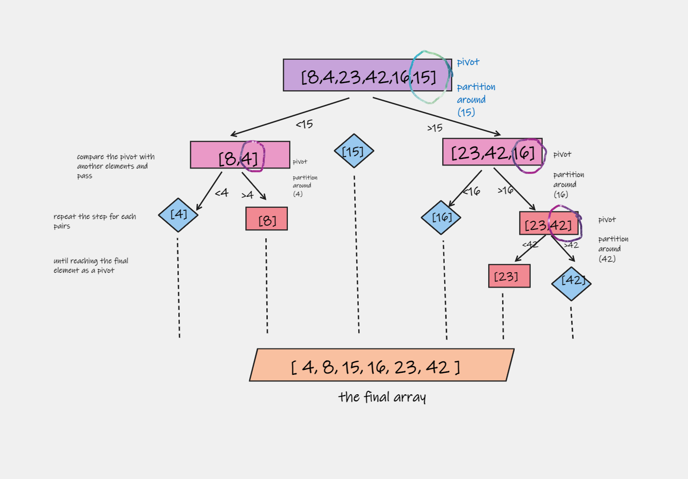

# Quick Sort

is a Divide and Conquer algorithm. It divides the input array into two halves, calls itself for the two halves, and then it merges the two sorted halves. The merge() function is used for merging two halves. 

## Trace

### The pseudocode

    ALGORITHM QuickSort(arr, left, right)
        if left < right
            // Partition the array by setting the position of the pivot value
            DEFINE position <-- Partition(arr, left, right)
            // Sort the left
            QuickSort(arr, left, position - 1)
            // Sort the right
            QuickSort(arr, position + 1, right)

    ALGORITHM Partition(arr, left, right)
        // set a pivot value as a point of reference
        DEFINE pivot <-- arr[right]
        // create a variable to track the largest index of numbers lower than the defined pivot
        DEFINE low <-- left - 1
        for i <- left to right do
            if arr[i] <= pivot
                low++
                Swap(arr, i, low)

        // place the value of the pivot location in the middle.
        // all numbers smaller than the pivot are on the left, larger on the right.
        Swap(arr, right, low + 1)
        // return the pivot index point
        return low + 1

    ALGORITHM Swap(arr, i, low)
        DEFINE temp;
        temp <-- arr[i]
        arr[i] <-- arr[low]
        arr[low] <-- temp

**Sample Array**:  [8,4,23,42,16,15]

**In General QuickSort works like this**:

 1. Select an element of the array. This element is generally called the pivot. Most often this element is either the first or the last element in the array.
 2. Then, rearrange the elements of the array so that all the elements to the left of the pivot are smaller than the pivot and all the elements to the right are greater than the pivot. The step is called partitioning. If an element is equal to the pivot, it doesn't matter on which side it goes.
 3. Repeat this process individually for the left and right side of the pivot, until the array is sorted.

**pass 1**
first check if the left index is less than the right index. If it is, then we know that we have more than one element to sort, then the partition function is called, the pivot value is set to the last element of the array which is 15. then  compare the values with 15, the left side now is [8,4] and keep for right [23,42,16]

**pass 2**
now we check each side alone and take a pivot for each one, for the left array now we take [4] as a pivot and compare the other elements if they bigger than 4, and make it to right.
the same for the right side we take [16] as a pivot, at the results we will have a right array [23,42]

**pass 3**
now we check each side alone and take a pivot for each one, for the left array now we take [42] as a pivot and compare the other elements if they less than 42, and make it to left.

**Pass 4**
the new left and right arrays lenght is less and equal 1 then the same arrays

in the end return first left after sorted and first pivot and left array sfter sorted

so the final array is  [4,8,15,16,23,42]

## Efficency

 - Time complexity:
    - Best Case : O(nlog(n)): the best-case occurs when the pivot element is the middle element or near to the middle element. 
    - Average Case : O(nlog(n)):  It occurs when the array elements are in jumbled order that is not properly ascending and not properly descending. 
    - Worst Case :O(n^2): occurs when the pivot element is either greatest or smallest element. Suppose, if the pivot element is always the last element of the array, the worst case would occur when the given array is sorted already in ascending or descending order.
 - Space: O(nlog(n))