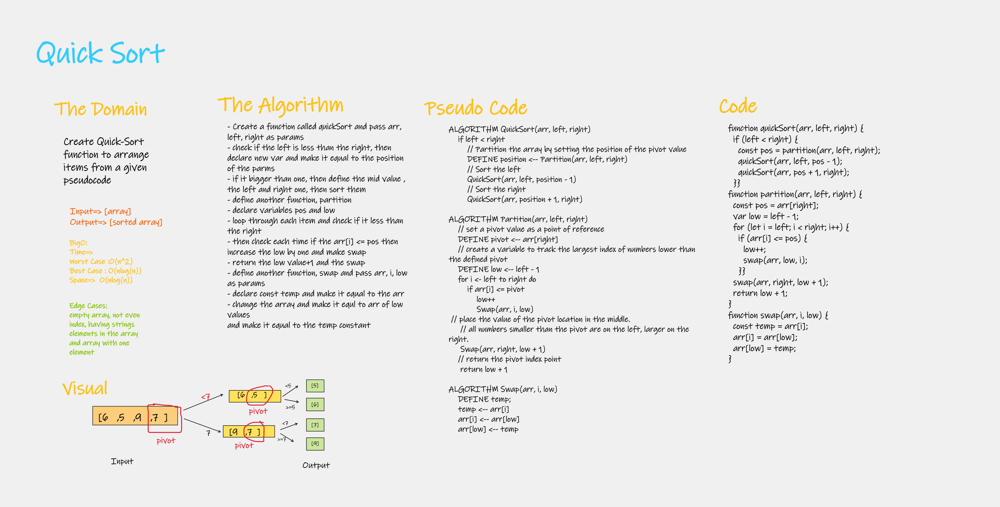
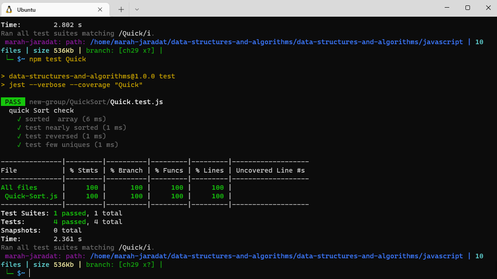

# Quick Sort

 is a Divide and Conquer algorithm. It picks an element as pivot and partitions the given array around the picked pivot.It divides elements into smaller parts based on some condition and performing the sort operations on those divided smaller parts.

## Features

**sorted**

- Create a Quick Sort function
- In your blog article, visually show the output of processing this input array:
    [8,4,23,42,16,15]

- For your own understanding, consider also stepping through these inputs:

    Reverse-sorted: [20,18,12,8,5,-2]
    Few uniques: [5,12,7,5,5,7]
    Nearly-sorted: [2,3,5,7,13,11]

- Write tests to prove the following functionality

    
## Approach & Efficiency

| method|Time complexity |Space complexity | 
| :---: | :---: | :---: |
|Quick-sort| O(nlog(n))"best case" O(n^2)"worst case": because the algorithm is recursive, & use if inside for loop | O(nlog(n)): is recursive|

## Tracing

[BLOG.md](./BLOG.md)

## Whiteboard Process

npm test Quick.test.js

