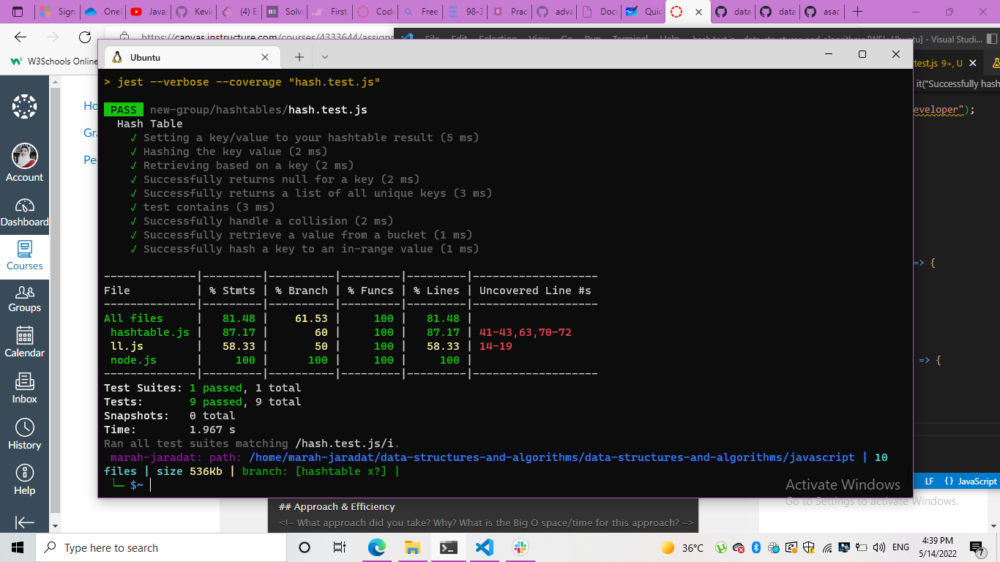

# Hashtables

Hash tables allow the storage and retrieval of data in an average time of O(1). At its most basic level, a hash table data structure is just an array. Data is stored into this array at specific indices designated by a hash function. A hash function is a mapping between the set of input data and a set of integers.

## Features

Implement a Hashtable Class with the following methods:
- set
    Arguments: key, value
    Returns: nothing
    This method should hash the key, and set the key and value pair in the table, handling collisions as needed.
    Should a given key already exist, replace its value from the value argument given to this method.
- get
    Arguments: key
    Returns: Value associated with that key in the table
- contains
    Arguments: key
    Returns: Boolean, indicating if the key exists in the table already.
- keys
    Returns: Collection of keys
- hash
    Arguments: key
    Returns: Index in the collection for that key

- Write tests to prove the following functionality

### Efficiency

| method|Time complexity |Space complexity | 
| :---: | :---: | :---: |
|hashtable|O(1)| O(n): n is the number of entries|

