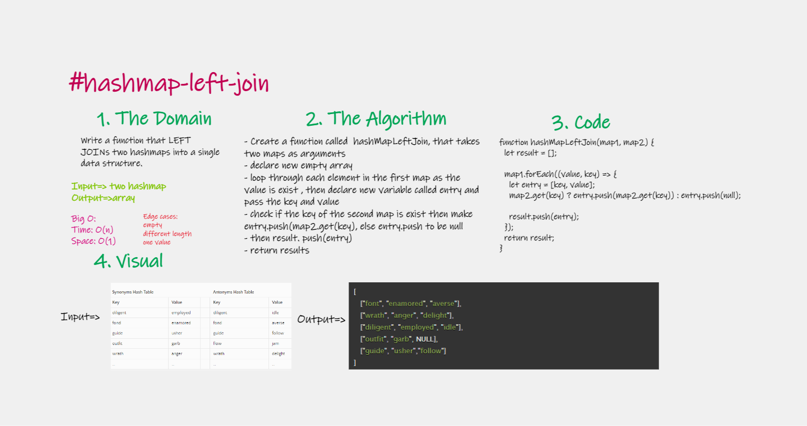
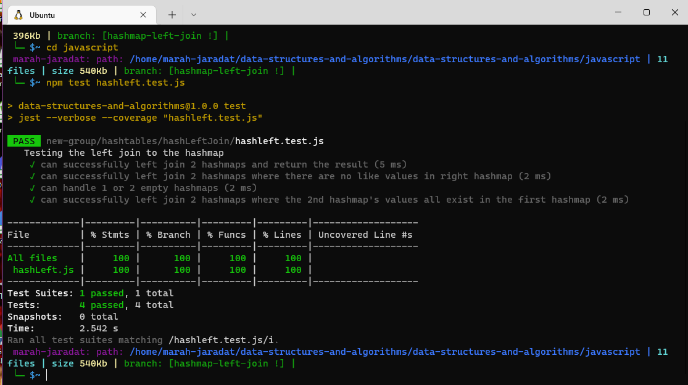

# Implement a simplified LEFT JOIN for 2 Hashmaps.

Write a function that LEFT JOINs two hashmaps into a single data structure.

## Features

- Write a function called left join
- Arguments: two hash maps
    - The first parameter is a hashmap that has word strings as keys, and a synonym of the key as values.
    - The second parameter is a hashmap that has word strings as keys, and antonyms of the key as values.
- Return: The returned data structure that holds the results is up to you. It doesn’t need to exactly match the output below, so long as it achieves the LEFT JOIN logic
- Write tests to prove the following functionality

    
## Approach & Efficiency

| method|Time complexity |Space complexity | 
| :---: | :---: | :---: |
| hashLeftJoin|O(n) | O(1)|

## Whiteboard Process

