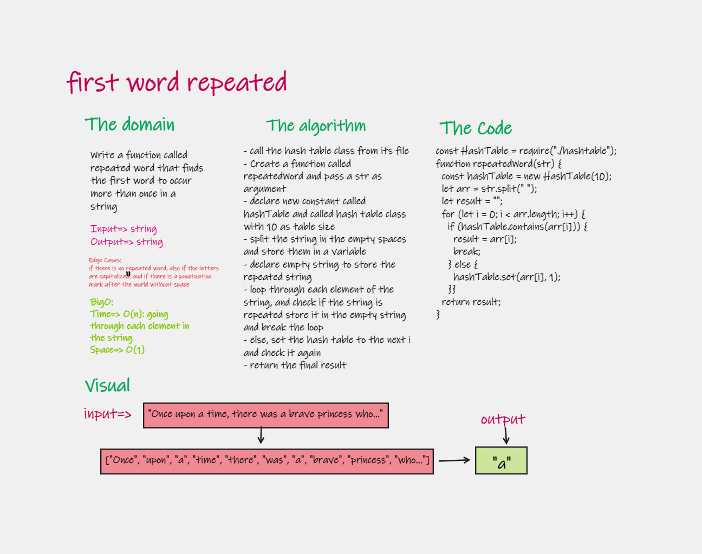
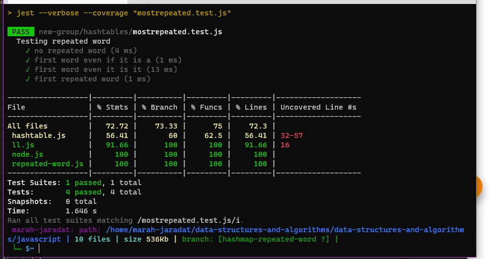

# first repeated word 

Write a function called repeated word that finds the first word to occur more than once in a string

## Features

return the first repeated repeated Word:
- Arguments: string
- Return: string

- Write tests to prove the following functionality

### Efficiency

| method|Time complexity |Space complexity | 
| :---: | :---: | :---: |
|hashtable|O(n): going through each element| O(1)|

