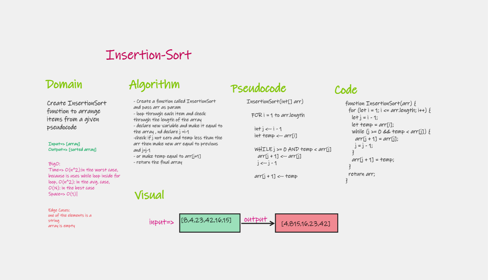
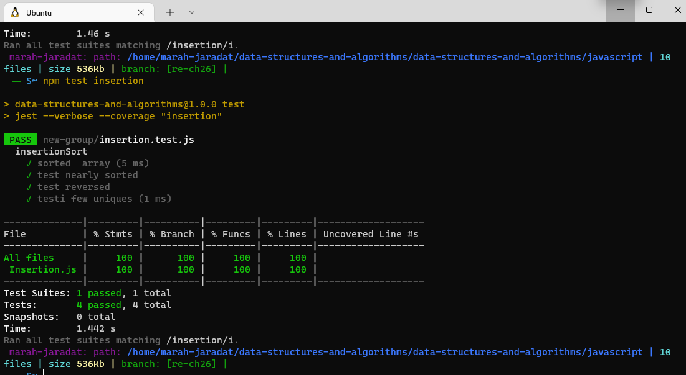

# Insertion Sort

Review the pseudocode below, then trace the algorithm by stepping through the process with the provided sample array. Document your explanation by creating a blog article that shows the step-by-step output after each iteration through some sort of visual.

## Features

- Create a Insertion-sort function
- In your blog article, visually show the output of processing this input array:
    [8,4,23,42,16,15]
- For your own understanding, consider also stepping through these inputs:
    Reverse-sorted: [20,18,12,8,5,-2]
    Few uniques: [5,12,7,5,5,7]
    Nearly-sorted: [2,3,5,7,13,11]

- Write tests to prove the following functionality

    
## Approach & Efficiency

| method|Time complexity |Space complexity | 
| :---: | :---: | :---: |
|Insertion-sort|O(n^2) | O(1)|

## Tracing

[BLOG.md](./BLOG.md)

## Whiteboard Process

