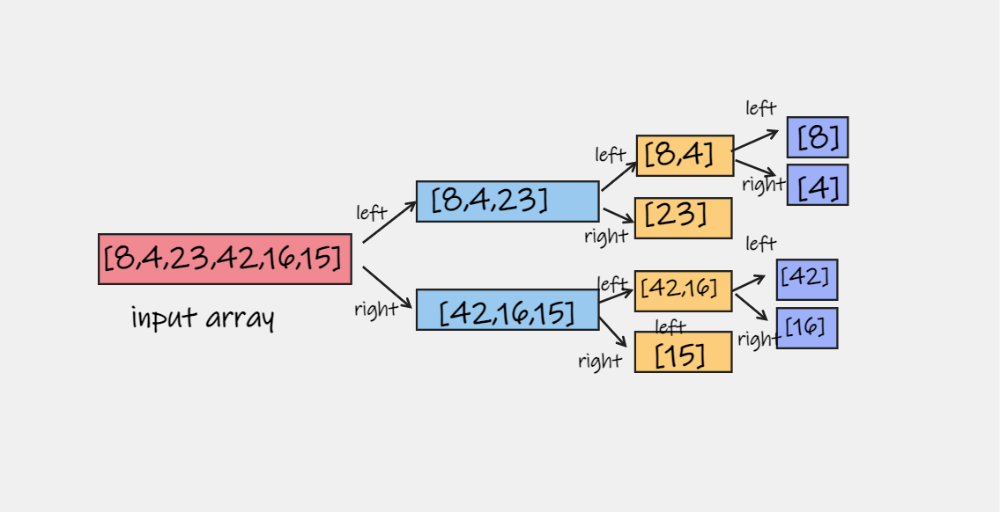
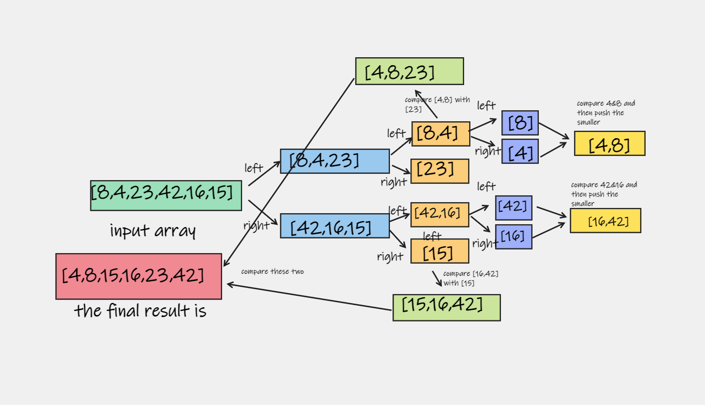

# Merge Sort

is a Divide and Conquer algorithm. It divides the input array into two halves, calls itself for the two halves, and then it merges the two sorted halves. The merge() function is used for merging two halves. 

## Trace

### The pseudocode

    ALGORITHM Mergesort(arr)
        DECLARE n <-- arr.length

        if n > 1
        DECLARE mid <-- n/2
        DECLARE left <-- arr[0...mid]
        DECLARE right <-- arr[mid...n]
        // sort the left side
        Mergesort(left)
        // sort the right side
        Mergesort(right)
        // merge the sorted left and right sides together
        Merge(left, right, arr)

    ALGORITHM Merge(left, right, arr)
        DECLARE i <-- 0
        DECLARE j <-- 0
        DECLARE k <-- 0

        while i < left.length && j < right.length
            if left[i] <= right[j]
                arr[k] <-- left[i]
                i <-- i + 1
            else
                arr[k] <-- right[j]
                j <-- j + 1

            k <-- k + 1

        if i = left.length
        set remaining entries in arr to remaining values in right
        else
        set remaining entries in arr to remaining values in left

## Sample Arrays

In your blog article, visually show the output of processing this input array:

    [8,4,23,42,16,15]

**pass 1:**
  we have this array for test  [8,4,23,42,16,15],we split() the array for two halves, and sort each one in every iteration, first the left side sorted is [8,4,23] and the right side it will be [42,16,15] and it will repeat splitting until we have one number in eac side

**pass 2:** 
 in the second iteration we declare new array and loop through left and rights and check if left[0] < right[0] if left[0] is less than right[0] push it to new array and remove the first element in left, and repeat the same chwcking for all the elements

**then:**

 keep iterate for each element, check the privious conditon for final left and final right return sorted array. then reurn the  final array that we have. 
    [4,8,15,16,23,42]

## Efficency

 - Time complexity: O(nLogn) in all 3 cases (worst, average and best) as merge sort always divides the array into two halves and takes linear time to merge two halves.
 - Space: O(n)