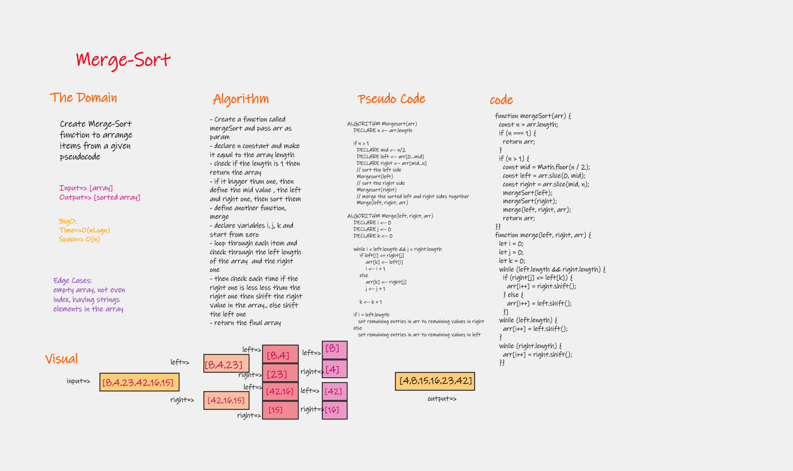
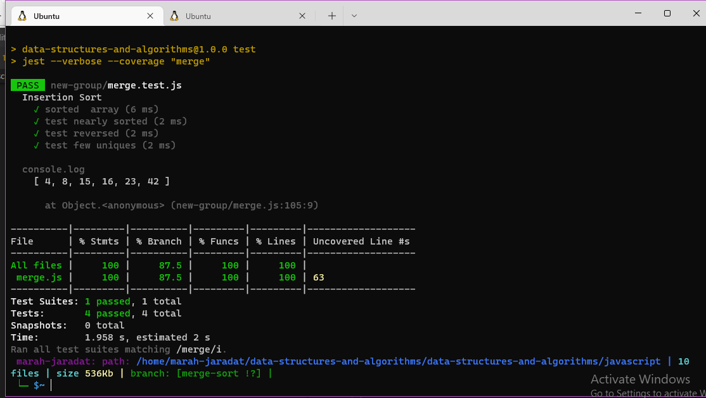

# Merge Sort

 is a Divide and Conquer algorithm. It divides the input array into two halves, calls itself for the two halves, and then it merges the two sorted halves. The merge() function is used for merging two halves.

## Features

- Create a merge-sort function
- In your blog article, visually show the output of processing this input array:
    [8,4,23,42,16,15]

- For your own understanding, consider also stepping through these inputs:

    Reverse-sorted: [20,18,12,8,5,-2]
    Few uniques: [5,12,7,5,5,7]
    Nearly-sorted: [2,3,5,7,13,11]

- Write tests to prove the following functionality
    
## Approach & Efficiency

| method|Time complexity |Space complexity | 
| :---: | :---: | :---: |
| Merge-sort|O(nlog(n))| O(n)|

## Tracing

[BLOG.md](./BLOG.md)

## Whiteboard Process

 npm test merge.test

