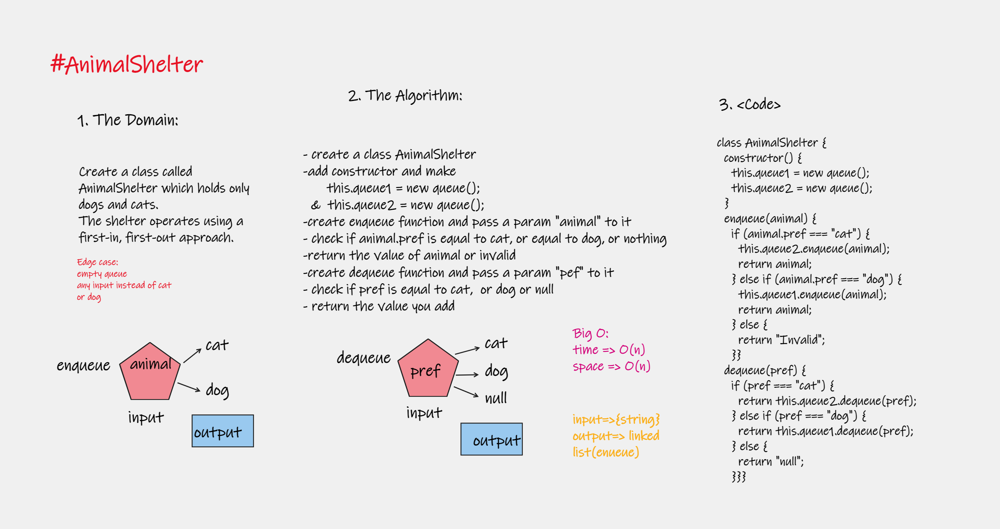

# Implementation: stack-queue-animal-shelter

create a class called AnimalShelter which holds only dogs and cats.
The shelter operates using a first-in, first-out approach.
Implement the following methods: enqueue,dequeue

## Features

1. Create Methods:
   - enqueue
      Arguments: animal
      animal can be either a dog or a cat object.
   - dequeue
      Arguments: pref
      pref can be either "dog" or "cat"
      Return: either a dog or a cat, based on preference.
      If pref is not "dog" or "cat" then return null.

2. Write tests to prove the following functionality

## Approach & Efficiency

| method|Time complexity |Space complexity | 
| :---: | :---: | :---: |
| enqueue|O(n): because used if | O(n)|
| dequeue|O(n): |O(n) |

## Whiteboard Process

