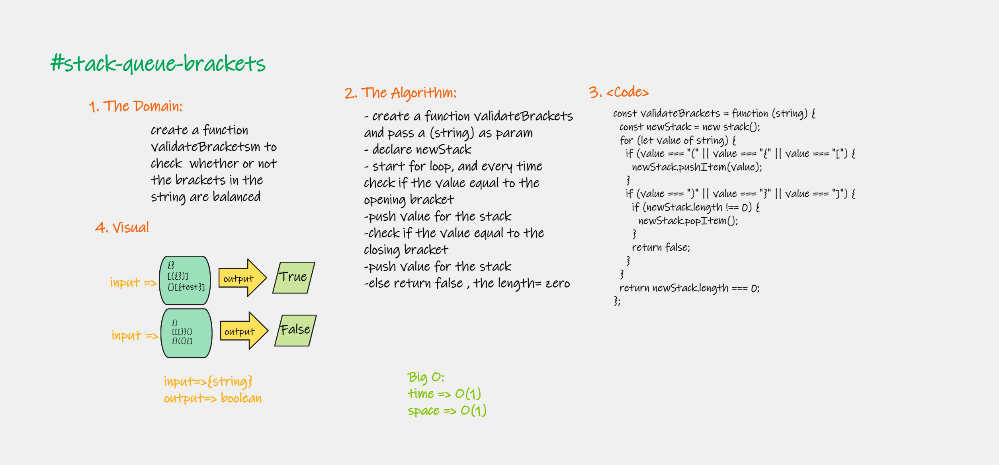
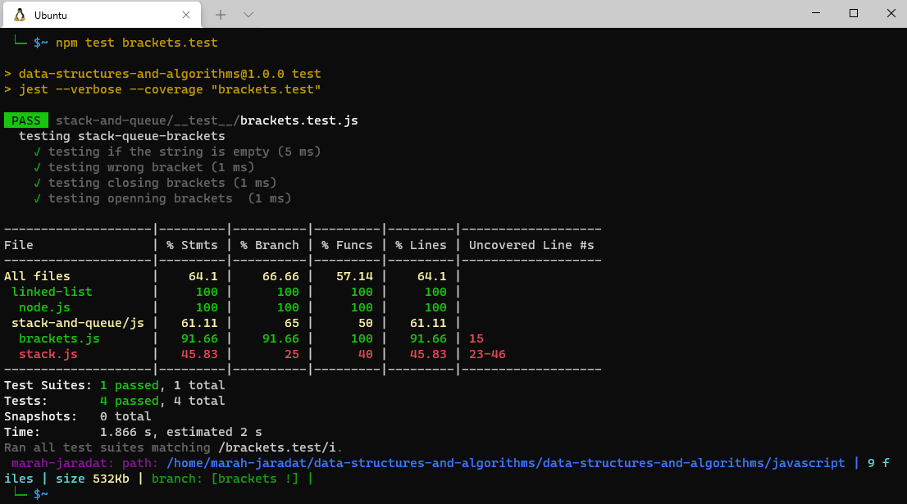

# Implementation: stack-queue-brackets

Create a new class called stack-queue-brackets.
Write a function called validate brackets, Return: boolean
representing whether or not the brackets in the string are balanced

## Features

There are 3 types of brackets:

Round Brackets : ()
Square Brackets : []
Curly Brackets : {}

2. Write tests to prove the following functionality

## Approach & Efficiency

| method|Time complexity |Space complexity | 
| :---: | :---: | :---: |
| brackets function|O(n): because used if and for| O(n)|

## Whiteboard Process

