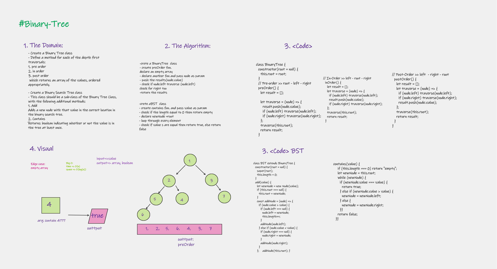

# Implementation: Binary-Tree & Binary Search Tree

Create a Node class that has properties for the value stored in the node, the left child node, and the right child node.

## Features

**### Binary Tree**

- Create a Binary Tree class
- Define a method for each of the depth first traversals:
    1. pre-order: root - left - right
    2. in-order: left - root - right
    3. post-order:left  - right - root
       which returns an array of the values, ordered  appropriately.

- Write tests to prove the following functionality

**### Binary Search Tree**

- Create a Binary Search Tree class
- This class should be a sub-class (or your languages equivalent) of the Binary Tree Class, with the following additional methods:
**1. Add**
    Arguments: value
    Return: nothing
    Adds a new node with that value in the correct location in the binary search tree.
**2. Contains**
    Argument: value
    Returns: boolean indicating whether or not the value is in the tree at least once.
    
## Approach & Efficiency

| method|Time complexity |Space complexity | 
| :---: | :---: | :---: |
| binary-tree|O(n):based on the no. of nodes | O(n): based on the height of the tree|
| binary-Search-tree|O(log(n))::based on the no. of nodes | O(h):based on the height of the tree|

## Whiteboard Process

.png)
.png)

