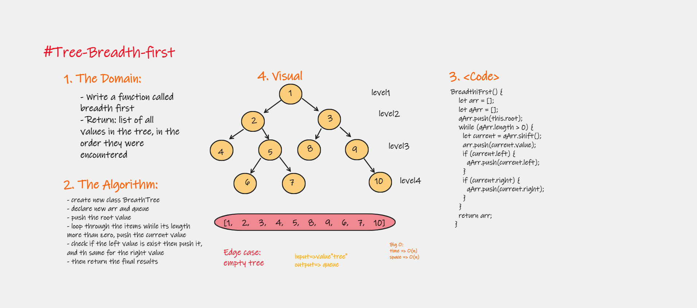

# Implementation: tree-breadth-first

Write a function called breadth first, which gives a list of vlues.

## Features

1. Arguments: tree
Return: list of all values in the tree, in the order they were encountered
NOTE: Traverse the input tree using a Breadth-first approach

2. Write tests to prove the following functionality

## Approach & Efficiency

| method|Time complexity |Space complexity | 
| :---: | :---: | :---: |
|breadth-tree|O(n):if & while | O(log(n))|

## Whiteboard Process

