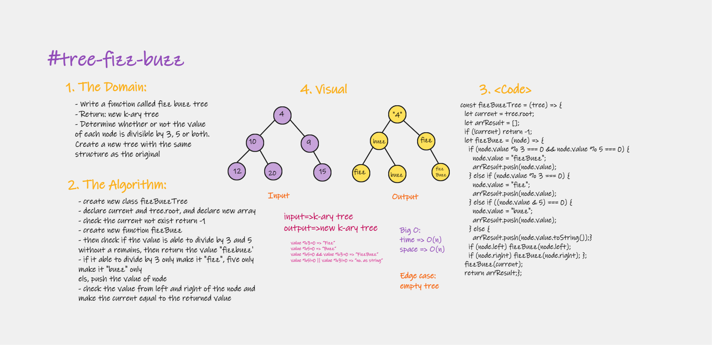
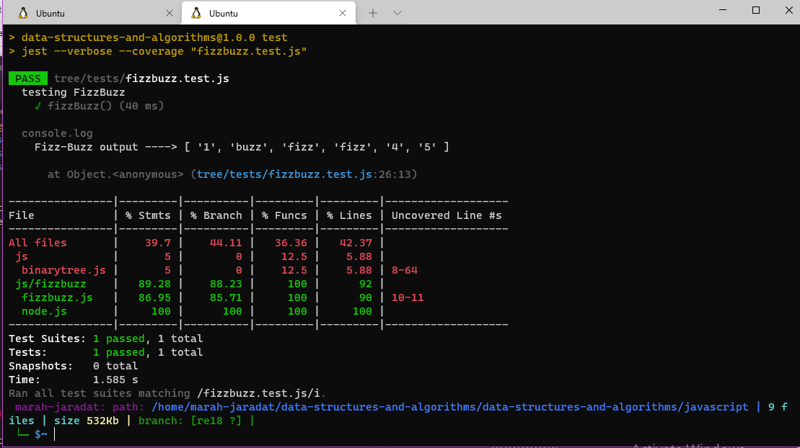

# Implementation: tree-breadth-first

Write a function called breadth first, which gives a list of vlues.

## Features

1. AWrite a function called fizz buzz tree
Arguments: k-ary tree
Return: new k-ary tree

Determine whether or not the value of each node is divisible by 3, 5 or both. Create a new tree with the same structure as the original, but the values modified as follows:

If the value is divisible by 3, replace the value with “Fizz”
If the value is divisible by 5, replace the value with “Buzz”
If the value is divisible by 3 and 5, replace the value with “FizzBuzz”
If the value is not divisible by 3 or 5, simply turn the number into a String.

2. Write tests to prove the following functionality

## Approach & Efficiency

| method|Time complexity |Space complexity | 
| :---: | :---: | :---: |
|breadth-tree|O(n):if & while | O(n)|

## Whiteboard Process

