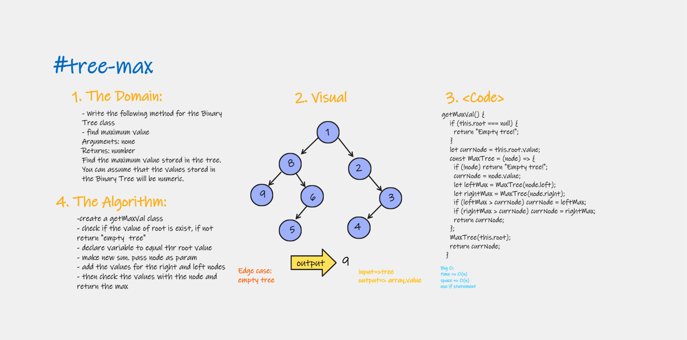
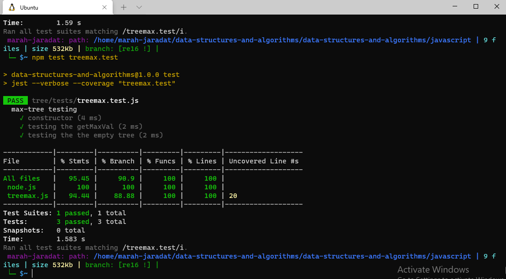

# Implementation: tree-max

Write the following method for the Binary Tree class

Find the maximum value stored in the tree. You can assume that the values stored in the Binary Tree will be numeric.

## Features

1. find maximum value
Arguments: none
Returns: number

2. Write tests to prove the following functionality

## Approach & Efficiency

| method|Time complexity |Space complexity | 
| :---: | :---: | :---: |
| max|O(n):just using if statement | O(n)|

## Whiteboard Process

