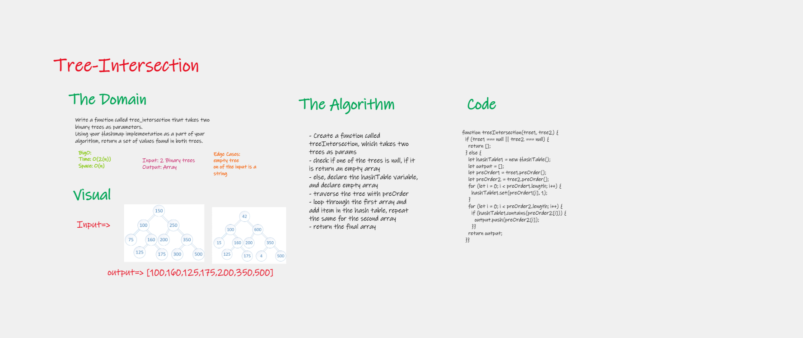
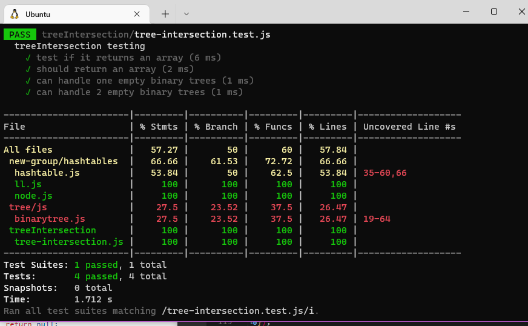

# tree-intersection

The intersection of two TreeSets can be done using the retainAll () method from java.util.TreeSet. The retainAll () method removes all the elements that are not same in both the TreeSets.

### Feature Tasks

- Write a function called tree_intersection that takes two binary trees as parameters.
- Using your Hashmap implementation as a part of your algorithm, return a set of values found in both trees.

### Structure and Testing

return the first repeated repeated Word:
  - Arguments: tree
  - Return: araay

- Write tests to prove the following functionality

### Efficiency

| method|Time complexity |Space complexity | 
| :---: | :---: | :---: |
|treeIntersection|O(2(n))| O(n)|

